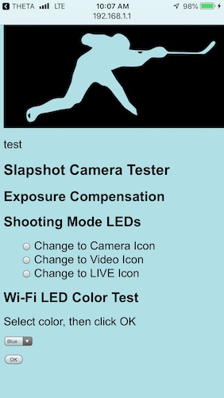

# Slapshot Camera Tester

This plug-in is used for testing the functionality of the camera in a sports setting. I like ice hockey. I am configuating a web page - viewed on a mobile phone - to configure and use the camera. This takes advantage of the WebGUI that can be used with RICOH THETA plug-ins. This is intended for use during practice, not games, as positioning of the camera and timing of picture taken is more realistic during practice.

# Main Functionality

* Take a picture
 * Check the box, then click OK at the exact moment you want to take the picture.
* Configuring the Shooting Mode LEDs on the front of the camera
 * You can change between the Camera, Video, and LIVE icons
* Configuring the Wi-Fi LED
 * Pick Blue, Red or White

# Main Screenshot

This screen shot shows how the web page appears and the main functionality that can be configured by the user.

I used the following tutorial 
[@3215](https://qiita.com/3215) as the starting pointing. The tutorial was translated
into English by the community.  Please see the discussion at the link
below to contribute.

https://community.theta360.guide/t/creating-a-webui-for-your-theta-plug-in/4054

